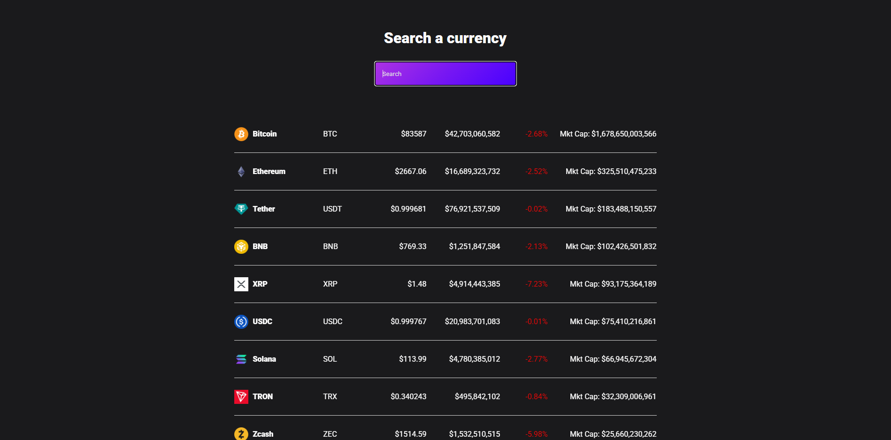

# CoinPulse - Crypto Price Tracker

A simple React app that shows live prices for the top 100 cryptocurrencies by market cap, with instant search.



## Features

- Live data from the [CoinGecko API](https://www.coingecko.com/en/api)
- Search coins by name
- Shows price, 24h volume, 24h change (red/green) and market cap

## Tech Stack

React 17 · Axios · CSS

## Getting Started

```bash
npm install
npm start
```

Then open [http://localhost:3000](http://localhost:3000).

## Deploy

```bash
npm run deploy
```


